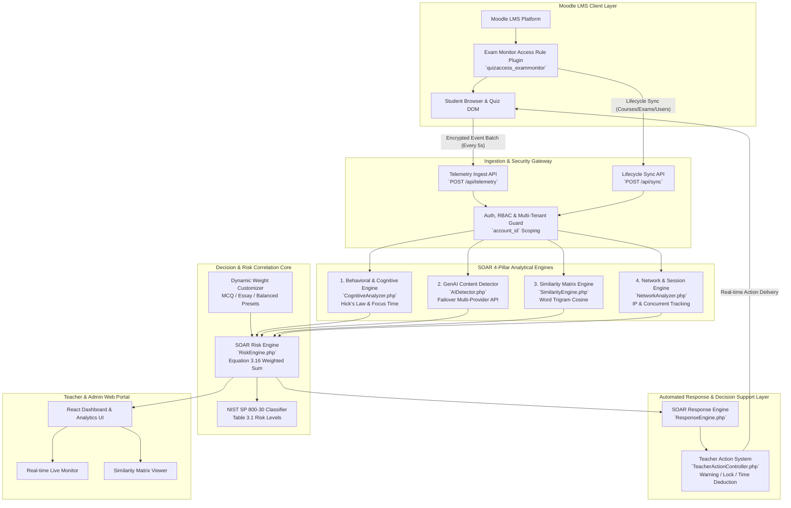
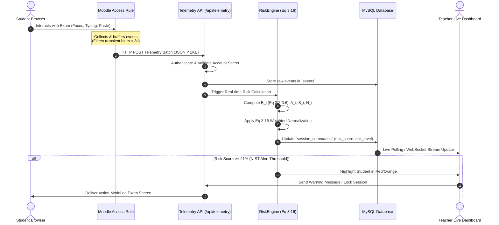
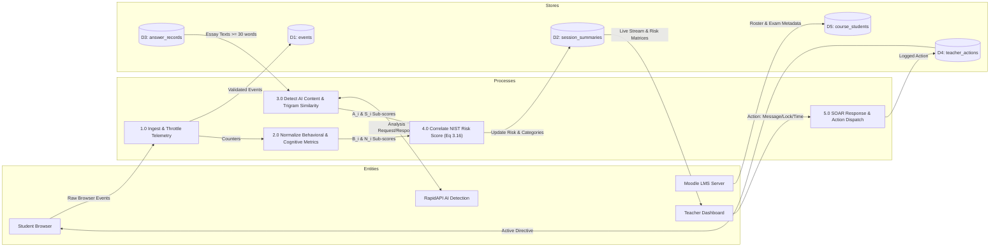

# SOAR Platform Architecture & Technical Design (Chapter 3)
============================================================

## 1. High-Level Architecture Overview

The **SOAR (Security Orchestration, Automation, and Response)** platform is designed specifically for academic exam integrity without compromising student privacy (no video streaming, no microphone recording, and no invasive filesystem scanning).

---

## 2. Telemetry Ingestion & Correlation Sequence Diagram

---

## 3. Data Flow Diagram (DFD - Level 1)

---

## 4. Key Mathematical Equations Implemented

### 4.1. Availability-Adjusted Risk Formula (Thesis Eq 3.16)
$$R_{i,\%} = 100 \times \frac{\sum_{k \in K_i} w_k X_{k,i}}{\sum_{k \in K_i} w_k}$$

Where:
* $w_B = \frac{4}{15} \approx 0.2667$ (Behavioral Sub-Score)
* $w_A = \frac{3}{15} = 0.2000$ (GenAI Content Detection Sub-Score)
* $w_S = \frac{4}{15} \approx 0.2667$ (Textual Similarity Sub-Score)
* $w_N = \frac{4}{15} \approx 0.2667$ (Network & Connectivity Sub-Score)

### 4.2. Behavioral Sub-Score Normalization (Thesis Eq 3.2 – 3.6)
$$B_i = \frac{n_F + n_D + n_P}{3}$$

Where:
* $n_F = \min\left(1, \frac{F_i}{Q_i}\right)$ ($F_i = \text{tab\_hidden} + \text{page\_leave} + \text{blur}$)
* $n_D = \min\left(1, \frac{D_i}{T_i}\right)$ ($D_i = \text{total absence duration in seconds}$)
* $n_P = \min\left(1, \frac{P_i}{2 \cdot Q_i}\right)$ ($P_i = \text{paste\_count} + \text{copy\_count}$)

### 4.3. Textual Word Trigram Cosine Similarity (Thesis Eq 3.9 – 3.11)
$$\text{Cosine}(A, B) = \frac{\mathbf{v}_A \cdot \mathbf{v}_B}{\|\mathbf{v}_A\| \|\mathbf{v}_B\|} = \frac{\sum_{t} f_A(t) f_B(t)}{\sqrt{\sum_t f_A(t)^2} \sqrt{\sum_t f_B(t)^2}}$$
$$m_{iq} = \begin{cases} 1 & \text{if } \max_{j \neq i} \text{Cosine}(A_{iq}, A_{jq}) \ge \tau \ (0.75) \\ 0 & \text{otherwise} \end{cases}$$
$$S_i = \frac{1}{Q_S} \sum_{q=1}^{Q_S} m_{iq}$$

---

## 5. NIST SP 800-30 Risk Levels (Thesis Table 3.1)

| Risk Range (%) | Risk Level | Label (Arabic) | Visual Indicator | SOAR Recommended Response |
|---|---|---|---|---|
| **[0.0% – 4.99%]** | `safe` | منخفض جداً | Green Badge | Normal session monitoring |
| **[5.0% – 20.99%]** | `low` | منخفض | Blue Badge | Log telemetry without active alert |
| **[21.0% – 79.99%]** | `medium` | متوسط | Amber Badge (**Alert Threshold**) | Flag student in Live Monitor for proctor attention |
| **[80.0% – 95.99%]** | `high` | مرتفع | Orange Badge | Deliver in-exam warning notification |
| **[96.0% – 100.0%]** | `critical` | مرتفع جداً | Red Glowing Badge | Teacher decision: lock session or deduct time |
